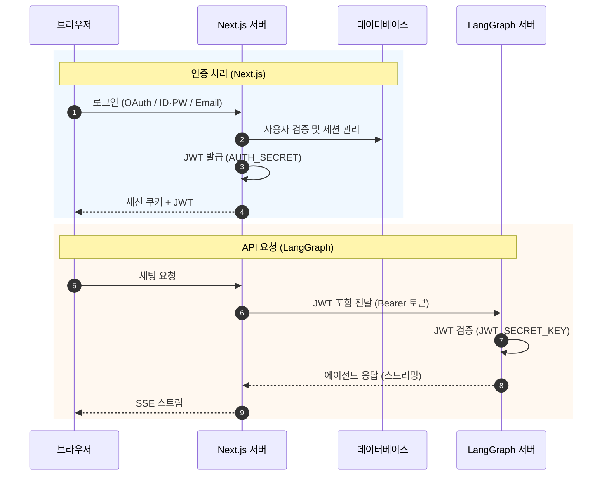

<div align="center">

# LangGraph Chat UI


**LangGraph 에이전트를 위한 채팅 인터페이스 — 인증, 관리자 대시보드, 다중 서버 관리 지원**

[English](./README.md) | 한국어

[문서](docs/) · [예제](examples/) · [이슈 제보](https://github.com/teddynote-lab/langgraph-chat-ui/issues)

</div>

## 이 프로젝트는?

[LangGraph](https://github.com/langchain-ai/langgraph) 에이전트와 상호작용하기 위한 Next.js 웹 애플리케이션입니다. 여러 LangGraph 서버에 연결하고, NextAuth 기반 인증으로 사용자를 관리하며, 관리자 대시보드에서 모든 설정을 제어할 수 있습니다.

## 주요 기능

### 채팅 인터페이스

- SSE 기반 실시간 응답 스트리밍
- 여러 LangGraph 서버 연결 관리 및 그래프 전환
- 도구 호출 시각화 및 서브그래프 노드 실행 추적
- 스레드 관리 (저장, 이름 변경, 삭제)
- 파일 업로드 (이미지 및 첨부파일)
- KaTeX LaTeX 렌더링, LangSmith 추적 연동
- `input_schema` 기반 자동 폼 UI 생성

### 인증 및 사용자 관리

- NextAuth: credentials, OAuth (Google, GitHub 등), email 매직 링크
- 회원가입 정책: 자유 가입 또는 관리자 승인
- 사용자 상태: 활성 / 대기 / 정지
- 역할 기반 접근: 관리자(admin) / 일반 사용자(user)
- `requireAuth`를 통한 모든 서버 액션 인증 체크

### 관리자 대시보드

- 사용자 관리: 목록 조회, 역할/상태 변경, 삭제
- 대기 중인 가입 요청 승인/거부
- 전역 설정: 기능 토글, 기본 Connection 값
- 사용자 관리 작업에 대한 감사 로그

### 커스터마이징

- 브랜딩: 로고, 앱 이름, 설명
- 다크 / 라이트 / 자동 테마
- 대화 시작 예시 질문 설정
- 마크다운 기반 사용자 가이드 페이지

## 빠른 시작

### 요구사항

- **Node.js** 22.13+
- **pnpm** 10+ (프로젝트는 pnpm 11.5.2를 고정 사용)
- 실행 중인 **LangGraph 서버** (`langgraph dev`)

### 설치 및 실행

```bash
git clone https://github.com/teddynote-lab/langgraph-chat-ui.git
cd langgraph-chat-ui
pnpm install
pnpm launch
```

`pnpm launch`를 실행하면 대화형 설정 마법사가 시작됩니다: 실행 모드, 인증 모드, LangGraph 서버 URL, LangSmith API 키, 데이터베이스 마이그레이션, 서버 자동 시작.

pnpm을 사용할 수 없거나 고정 버전이 적용되지 않으면 `corepack enable` 실행 후 다시 시도하세요.

> 인증 모드별 상세 설정은 `examples/` 폴더의 예제를 참고하세요.

### 인증 모드

| 모드 | 설명 | NextAuth | DB 필요 |
|---|---|---|---|
| `standalone` | 인증 없이 바로 사용 (로컬 개발용) | - | - |
| `credentials` | 이메일/비밀번호 로그인 | O | O |
| `oauth` | Google, GitHub 등 OAuth 로그인 | O | O |
| `email` | 매직 링크 (비밀번호 없이 로그인) | O | O |
| `oauth-direct` | LangGraph 서버가 OAuth 처리 | - | - |

### 수동 설정

`pnpm launch`를 사용하지 않고 수동으로 설정하려면:

```bash
cp frontend/.env.example frontend/.env
# frontend/.env를 편집한 후:
cd frontend
pnpm db:setup   # credentials, oauth, email 모드에서 필요
pnpm dev
```

브라우저에서 `http://localhost:3000`으로 접속합니다. `credentials`, `oauth`, `email` 모드에서 최초 회원가입한 사용자는 자동으로 관리자 권한을 부여받습니다.

## 설정

설정 파일은 `frontend/src/configs/site.ts`에 있습니다:

```typescript
export const siteConfig = {
  meta: {
    title: "LangGraph Chat UI",
    description: "A production-ready chat interface for LangGraph agents",
  },
  branding: {
    appName: "LangGraph Chat UI",
    logoPath: "/logo.svg",
    description: "Ask your LangGraph agent anything.",
  },
  buttons: {
    enableFileUpload: true,
    chatInputPlaceholder: "Ask anything...",
  },
  threads: {
    showHistory: true,
    enableDeletion: true,
    enableTitleEdit: true,
    sidebarOpenByDefault: true,
  },
  theme: {
    colorScheme: "light", // light, dark, auto
  },
};
```

### Connection 관리

앱 내 설정 패널에서 여러 LangGraph 서버를 관리할 수 있습니다:

- **API URL** (필수) — LangGraph 서버 URL
- **Connection 이름** — 구분을 위한 이름
- **Assistant ID** — Graph ID (미입력시 목록에서 선택)
- **API 키** — LangSmith API 키

## 인증 시스템

### 아키텍처

Next.js에서 DB 기반 사용자 인증을 처리하고, LangGraph 서버는 JWT 검증만 수행합니다.



> **중요**: `AUTH_SECRET` (Next.js)과 `JWT_SECRET_KEY` (LangGraph)는 동일한 값이어야 합니다.

### 지원 데이터베이스

SQLite (개발), PostgreSQL, MySQL을 지원합니다. `DATABASE_PROVIDER`와 `DATABASE_URL` 환경변수를 설정하세요. 스키마 설정은 `pnpm db:setup`으로 자동 처리됩니다.

### 회원가입 정책

관리자 대시보드에서 설정 가능:

- `open` — 자유 가입 (기본값)
- `approval` — 관리자 승인 후 활성화

### 사용자 상태

- `active` — 정상 사용 가능
- `pending` — 승인 대기 중 (로그인 불가)
- `suspended` — 정지됨 (로그인 불가)

LangGraph Platform에 JWT 기반 인증을 연동하는 방법은 [인증 가이드](docs/00-OVERVIEW.ko.md)를 참고하세요.

## 관리자 대시보드

`/admin` 경로에서 접근:

- **사용자 관리** — 목록 조회, 역할/상태 변경, 삭제
- **가입 승인** — 대기 중인 가입 요청 승인/거부
- **전역 설정** — 회원가입 정책, 기능 토글, 기본 Connection, Connection 선택 허용 여부

## 보안

| 영역 | 조치 |
|---|---|
| **Server Actions** | 모든 서버 액션에 인증 체크 (`requireAuth`) |
| **API 프록시** | SSRF 방지 (프라이빗 IP 차단), CORS 출처 제한 |
| **쿠키 보안** | Connection 쿠키에 `httpOnly`, `secure` 플래그 적용 (프로덕션 환경만) |
| **파일 업로드** | MIME 타입 기반 확장자 결정, SVG XSS 방지 |
| **JWT** | 공유 시크릿 기반 서버 간 인증, 안전한 토큰 생성 |
| **데이터 무결성** | Prisma 트랜잭션으로 원자적 사용자 상태 변경 |
| **입력 검증** | LangSmith API의 UUID 형식 검증 |

## 배포

| 옵션 | LangSmith 필요 | 인프라 |
|---|---|---|
| LangGraph Platform | O (무료 가능) | Redis + PostgreSQL |
| FastAPI Standalone | - | 선택적 |

자세한 내용은 [배포 가이드](docs/LANGGRAPH_DEPLOYMENT_GUIDE.ko.md)를 참고하세요.

### Docker

```bash
# UI + PostgreSQL
docker compose up -d

# 통합 스택 (UI + LangGraph 서버 + PostgreSQL + Redis)
docker compose -f docker-compose.full.yml up -d
```

### Vercel

[](https://vercel.com/new/clone?repository-url=https://github.com/teddynote-lab/langgraph-chat-ui)

> Vercel은 서버리스 환경이므로 SQLite를 사용할 수 없습니다. `DATABASE_PROVIDER=postgresql`로 PostgreSQL을 사용하세요.

## 기술 스택

| 영역 | 기술 |
|---|---|
| 프레임워크 | Next.js 15 (App Router) |
| UI | React 19, Radix UI, Framer Motion |
| 스타일링 | Tailwind CSS 4 |
| 언어 | TypeScript |
| 인증 | NextAuth.js v5 beta (Auth.js) |
| 데이터베이스 | Prisma ORM (SQLite / PostgreSQL / MySQL) |
| LangGraph | @langchain/langgraph-sdk |
| 마크다운 | react-markdown, KaTeX, remark-gfm |

## 문서

| 문서 | 설명 |
|---|---|
| [빠른 시작](docs/QUICK_START.md) | 5분 안에 실행 (standalone, 인증 없음) |
| [통합 가이드](docs/INTEGRATION.md) | LangGraph 서버 연결 + JWT 인증 설정 |
| [인증 가이드](docs/00-OVERVIEW.ko.md) | 인증 방식 비교 및 선택 가이드 |
| [프로덕션 배포](docs/PRODUCTION.md) | Docker, Vercel, 자체 호스팅 배포 |
| [환경변수](docs/ENV_MATRIX.md) | auth mode별 전체 환경변수 |
| [트러블슈팅](docs/TROUBLESHOOTING.md) | 자주 발생하는 에러와 해결법 |
| [예제 모음](examples/) | 인증 모드별 설정 예제 |

## 기여하기

```bash
pnpm install
pnpm dev          # 개발 서버 (:3000)
pnpm lint         # ESLint
pnpm format:check # Prettier
pnpm build        # 프로덕션 빌드
```

Fork 후 브랜치를 만들어 PR을 제출해주세요. CI에서 `pnpm lint`와 `pnpm format:check`를 통과해야 머지할 수 있습니다.

---

<div align="center">
<sub>Built by <a href="https://www.braincrew.co.kr">Braincrew</a></sub>
</div>
