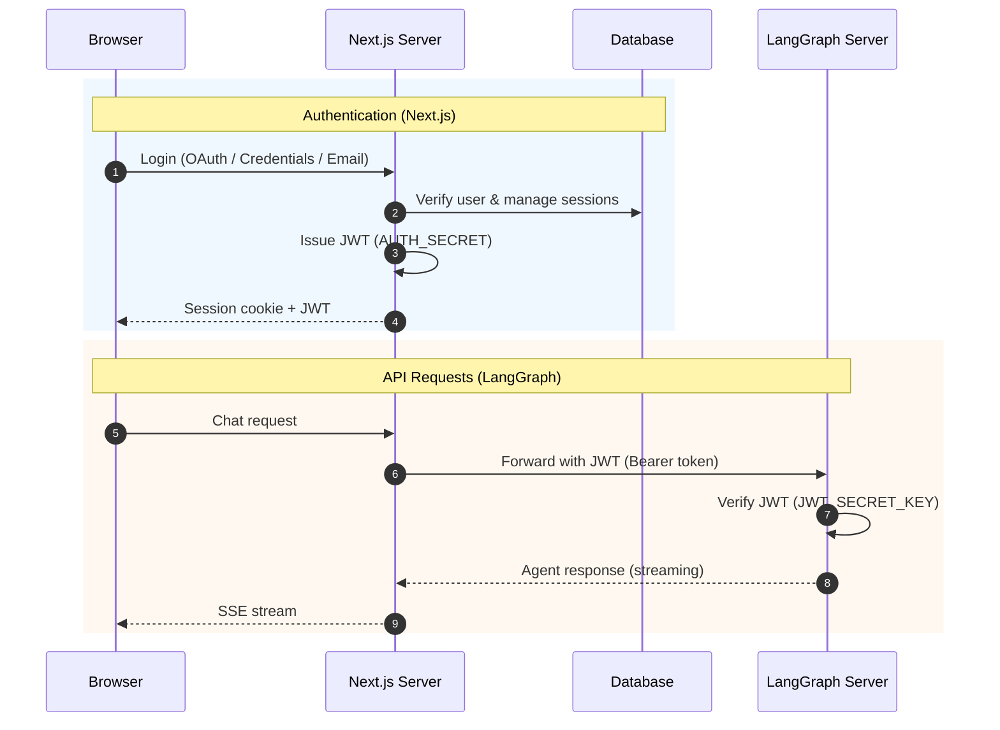

<div align="center">

# LangGraph Chat UI


**Chat interface for LangGraph agents with auth, admin dashboard, and multi-server management**

English | [한국어](./README.ko.md)

[Docs](docs/) · [Examples](examples/) · [Report Issue](https://github.com/teddynote-lab/langgraph-chat-ui/issues)

</div>

## What is this?

A Next.js web app for interacting with [LangGraph](https://github.com/langchain-ai/langgraph) agents. Connect to multiple LangGraph servers, manage users with NextAuth-based auth, and configure everything from an admin dashboard.

## Features

### Chat Interface

- SSE-based real-time response streaming
- Multiple LangGraph server connections with graph switching
- Tool call visualization and subgraph node execution tracking
- Thread management (save, rename, delete)
- File upload (images and attachments)
- KaTeX LaTeX rendering, LangSmith trace linking
- Automatic form UI from `input_schema`

### Authentication & User Management

- NextAuth: credentials, OAuth (Google, GitHub, etc.), email magic link
- Signup policy: open or admin approval
- User status: active / pending / suspended
- Role-based access: admin and regular user
- Auth checks on all server actions via `requireAuth`

### Admin Dashboard

- User management: list, role/status changes, deletion
- Signup approval/rejection for pending requests
- Global settings: feature toggles, default connection values
- Audit logging for management operations

### Customization

- Branding: logo, app name, description
- Dark / light / auto theme
- Configurable conversation starter questions
- Markdown-based user guide page

## Quick Start

### Prerequisites

- **Node.js** 22.13+
- **pnpm** 10+ (the project pins pnpm 11.5.2)
- A running **LangGraph server** (`langgraph dev`)

### Installation

```bash
git clone https://github.com/teddynote-lab/langgraph-chat-ui.git
cd langgraph-chat-ui
pnpm install
pnpm launch
```

`pnpm launch` runs an interactive setup wizard: run mode, auth mode, LangGraph server URL, LangSmith API key, database migration, and auto-start.

If pnpm is unavailable or does not use the pinned version, run `corepack enable` and retry.

> See `examples/` for per-mode configuration examples.

### Auth Modes

| Mode | Description | NextAuth | DB Required |
|---|---|---|---|
| `standalone` | No auth, immediate use (local dev) | - | - |
| `credentials` | Email/password login | Yes | Yes |
| `oauth` | Google, GitHub, etc. OAuth | Yes | Yes |
| `email` | Magic link (passwordless) | Yes | Yes |
| `oauth-direct` | LangGraph server handles OAuth | - | - |

### Manual Setup

Instead of `pnpm launch`, configure manually:

```bash
cp frontend/.env.example frontend/.env
# Edit frontend/.env with your settings, then:
cd frontend
pnpm db:setup   # Required for credentials, oauth, email modes
pnpm dev
```

Open `http://localhost:3000`. When using `credentials`, `oauth`, or `email` auth mode, the first user to sign up gets admin privileges.

## Configuration

Settings are in `frontend/src/configs/site.ts`:

```typescript
export const siteConfig = {
  meta: {
    title: "LangGraph Chat UI",
    description: "A production-ready chat interface for LangGraph agents",
  },
  branding: {
    appName: "LangGraph Chat UI",
    logoPath: "/logo.svg",
    description: "Ask your LangGraph agent anything.",
  },
  buttons: {
    enableFileUpload: true,
    chatInputPlaceholder: "Ask anything...",
  },
  threads: {
    showHistory: true,
    enableDeletion: true,
    enableTitleEdit: true,
    sidebarOpenByDefault: true,
  },
  theme: {
    colorScheme: "light", // light, dark, auto
  },
};
```

### Connection Management

Manage multiple LangGraph servers from the in-app settings panel:

- **API URL** (required) — LangGraph server URL
- **Connection Name** — Display name for identification
- **Assistant ID** — Graph ID (shows selection list if empty)
- **API Key** — LangSmith API key

## Authentication

### Architecture

Next.js handles DB-based user auth; the LangGraph server only verifies JWTs.



> **Important**: `AUTH_SECRET` (Next.js) and `JWT_SECRET_KEY` (LangGraph) must be the same value.

### Supported Databases

SQLite (development), PostgreSQL, and MySQL. Set `DATABASE_PROVIDER` and `DATABASE_URL` in your env. Schema setup is handled by `pnpm db:setup`.

### Signup Policy

Configurable from the admin dashboard:

- `open` — Open signup (default)
- `approval` — Admin approval required

### User Status

- `active` — Normal access
- `pending` — Awaiting approval (login disabled)
- `suspended` — Suspended (login disabled)

For JWT-based auth with LangGraph Platform, see the [Auth Guide](docs/00-OVERVIEW.md).

## Admin Dashboard

Access at `/admin`:

- **User management** — list, role/status changes, deletion
- **Signup approval** — approve or reject pending requests
- **Global settings** — signup policy, feature toggles, default connection, connection selection permissions

## Security

| Area | Measure |
|---|---|
| **Server Actions** | Auth checks on all server actions (`requireAuth`) |
| **API Proxy** | SSRF prevention (private IP blocking), CORS origin restrictions |
| **Cookie Security** | `httpOnly` and `secure` flags on connection cookies (production only) |
| **File Upload** | MIME-type-based extension detection, SVG XSS prevention |
| **JWT** | Shared-secret server-to-server auth, secure token generation |
| **Data Integrity** | Prisma transactions for atomic user state changes |
| **Input Validation** | UUID format validation on LangSmith API parameters |

## Deployment

| Option | LangSmith Required | Infrastructure |
|---|---|---|
| LangGraph Platform | Yes (free tier available) | Redis + PostgreSQL |
| FastAPI Standalone | No | Optional |

See the [Deployment Guide](docs/LANGGRAPH_DEPLOYMENT_GUIDE.md) for details.

### Docker

```bash
# UI + PostgreSQL
docker compose up -d

# Full stack (UI + LangGraph server + PostgreSQL + Redis)
docker compose -f docker-compose.full.yml up -d
```

### Vercel

[](https://vercel.com/new/clone?repository-url=https://github.com/teddynote-lab/langgraph-chat-ui)

> SQLite is not supported on Vercel. Use PostgreSQL with `DATABASE_PROVIDER=postgresql`.

## Tech Stack

| Area | Technology |
|---|---|
| Framework | Next.js 15 (App Router) |
| UI | React 19, Radix UI, Framer Motion |
| Styling | Tailwind CSS 4 |
| Language | TypeScript |
| Auth | NextAuth.js v5 beta (Auth.js) |
| Database | Prisma ORM (SQLite / PostgreSQL / MySQL) |
| LangGraph | @langchain/langgraph-sdk |
| Markdown | react-markdown, KaTeX, remark-gfm |

## Documentation

| Document | Description |
|---|---|
| [Quick Start](docs/QUICK_START.md) | Get running in 5 minutes (standalone, no auth) |
| [Integration Guide](docs/INTEGRATION.md) | Connect to your LangGraph server with auth + JWT |
| [Auth Guide](docs/00-OVERVIEW.md) | Auth method comparison and selection guide |
| [Production Deployment](docs/PRODUCTION.md) | Docker, Vercel, self-hosted deployment |
| [Environment Variables](docs/ENV_MATRIX.md) | All env vars by auth mode |
| [Troubleshooting](docs/TROUBLESHOOTING.md) | Common errors and fixes |
| [Examples](examples/) | Per-auth-mode configuration examples |

## Contributing

```bash
pnpm install
pnpm dev          # dev server on :3000
pnpm lint         # ESLint
pnpm format:check # Prettier
pnpm build        # production build
```

Fork the repo, create a branch, and open a PR. CI requires `pnpm lint` and `pnpm format:check` to pass.

---

<div align="center">
<sub>Built by <a href="https://www.braincrew.co.kr">Braincrew</a></sub>
</div>
